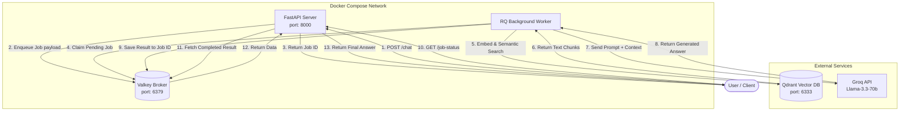

# How It Works: RAG Queue Architecture

This document breaks down the underlying architecture of the RAG Queue project, explaining how data flows through the system and why it is structured this way.

## Overview

This project implements a **Retrieval-Augmented Generation (RAG)** system built on a **task queue architecture**. 

Normally, querying a vector database and waiting for an LLM (Large Language Model) to generate a response takes multiple seconds. If we did this directly inside our main web server, the server would be essentially "frozen" for that user and unable to handle multiple requests at the same time. 

To solve this, we split the application into two main compute engines: an **API Server** for fast HTTP responses, and a **Background Worker** for the heavy AI lifting.

---

## Core Components

1. **FastAPI (`server.py`)**: The main web interface. It acts exclusively as a traffic controller, receiving incoming questions and returning statuses instantly without doing any heavy processing.
2. **Valkey (Message Broker)**: An open-source fork of Redis. It acts as the "waiting room" (or state store). It holds jobs in a queue until a worker is ready to process them, and holds the final answers once they are done.
3. **RQ (Redis Queue)**: The Python library (`rq`) we use. It connects to Valkey using the standard Redis protocol and handles pulling/pushing jobs in and out of the database.
4. **Worker (`queues/worker.py`)**: A separate background process/container. It continuously listens to Valkey for new jobs, claims them, and executes the actual RAG pipeline.
5. **Qdrant**: Our separate vector database where our PDF text chunks are already indexed inside the `learning_rag` collection.
6. **Groq (Llama-3.3-70b)**: The external LLM provider that reads our retrieved context and generates the final English response.

---

## Step-by-Step Data Flow

Here is exactly what happens when a user asks a question:

### 1. The User Request
A user sends a POST request with their question (`query`) to the FastAPI server (`POST /chat`). 

### 2. Enqueuing the Job
FastAPI does **not** process the heavy query. Instead, it uses the RQ library to package the `process_query` instruction payload alongside the user's query. It sends this package to the **Valkey** database. 
Valkey stores the job and returns a unique `job_id`. FastAPI immediately returns this `job_id` to the user and closes the connection. 

### 3. Background Processing (Different Compute)
Running in a completely separate Docker container, our **Worker** is constantly polling Valkey, asking, *"Do you have work for me?"*
The Worker detects the new job, claims it, and executes the `process_query` function.

### 4. Vector Retrieval (Semantic Search)
Inside the `process_query` function, the Worker:
* Converts the text query into a mathematical vector using HuggingFace embeddings.
* Connects to **Qdrant** (`http://host.docker.internal:6333`).
* Performs a semantic search to find the text chunks that are most relevant to the question.

### 5. AI Generation
The Worker grabs those retrieved text chunks and bundles them together into a large `context` string. 
It places this context inside a strict `SYSTEM_PROMPT` and ships it off to the **Groq API**. Groq processes the context with the `llama-3.3-70b` model and replies with an answer.

### 6. Saving the Result
The Worker finishes the function and returns the final AI string. The RQ library automatically takes this return value and saves it into **Valkey** under the original `job_id`, marking the status as "finished".

### 7. The Follow-up
The user (or frontend client) sends a request to `GET /job-status?job_id=...`. FastAPI quickly checks Valkey for that specific ID. Since the Worker is done, Valkey provides the answer, and FastAPI serves it back to the user.

---

## Visual Architecture Diagram

## Why this Architecture?
* **Non-Blocking:** By moving the 5-10 second AI generation step out of the HTTP request cycle, the FastAPI server remains lighting fast and can accept thousands of concurrent requests.
* **Scalable:** If you start getting too many requests, you can simply spin up 5 more Worker containers. They will all connect to the same Valkey queue and process jobs in parallel.
* **Resilient:** If a job fails because the Groq API times out, the queue remembers the job and can easily retry it.